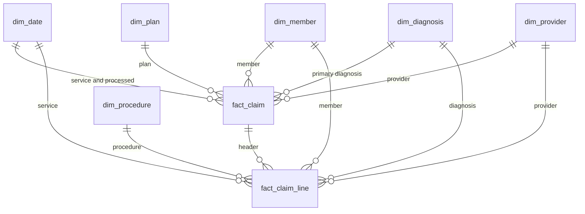

# Data model

MedInsure’s claims warehouse is a star schema in the `warehouse` schema. The OLTP-shaped tables stay in `source`. `staging` holds the versioned history and the claim batch the load is about to accept or reject. `audit` holds watermarks and rejected claims.

DDL for this model is in `sql/03_dimensions/` and `sql/04_facts/`.

## Grain

**fact_claim** is one row per claim header, one adjudicated encounter.

**fact_claim_line** is one row per service line within a claim.

`claim_id` is the natural key of the header. `claim_id` plus `line_number` is the natural key of the line. Both stay on the facts as degenerate dimensions. A claim number has no descriptive attributes of its own, so it does not get a dimension table.

## Fact type

Both facts are transaction facts. Each row is one event, and the money and unit measures add across rows. A periodic snapshot would be a balance at month end, and an accumulating snapshot would be milestone dates as a claim moved from submitted to paid. Denial is a status on the transaction.

`fact_claim_line` loads after `fact_claim`. Each line resolves `claim_key` from the degenerate `claim_id` on the header, and it copies that header’s `member_key` and `provider_key` so a line query uses the same SCD version as the encounter.

## Dimensions

Every dimension uses a `BIGSERIAL` surrogate key. Fact foreign keys are `BIGINT`.

| Table | SCD | Natural key | What a new version means |
|---|---|---|---|
| `dim_date` | Static | `calendar_date` | A day does not change. Loaded for 2020-01-01 through 2030-12-31 with `generate_series`. |
| `dim_member` | Type 2 | `member_id` + `effective_start` | `plan_id`, `state`, or `zip_code` changed. Name, birth date, gender, and enrollment date are copied onto each version and do not open one. |
| `dim_provider` | Type 2 | `provider_id` + `effective_start` | `network_status` or `specialty` changed. `network_effective_date` moves only when network status changes; a specialty-only change carries the previous network date forward. |
| `dim_diagnosis` | Type 1 | `diagnosis_code` | ICD-10 description or category is corrected in place. `category_code` is the three-character family. |
| `dim_procedure` | Type 1 | `procedure_code` | CPT description or category is corrected in place. |
| `dim_plan` | Type 1 | `plan_id` | Deductible, out-of-pocket maximum, coinsurance, and plan type (`HMO`, `PPO`, `EPO`, `HDHP`) belong to the plan code. A redesigned benefit is a new `plan_id`. |

`dim_member` stores `plan_id` for change detection and `plan_key` as the foreign key to `dim_plan`. `fact_claim.plan_key` comes from the member version effective on the service date.

Type 2 tables carry `effective_start`, `effective_end`, and `is_current`. The open version ends on `9999-12-31`. Ranges are inclusive. A partial unique index on the natural key `WHERE is_current` allows one current row per member and per provider.

### Conformed dimensions

`dim_date`, `dim_member`, `dim_plan`, and `dim_provider` are conformed. A future `fact_pharmacy` table uses the same member, the same calendar, the same plan, and the provider as the prescriber.

`dim_date` is role-playing. `fact_claim` references it as `service_date_key` and `processed_date_key`. The calendar table is not copied per role.

### Degenerate dimensions

- `fact_claim.claim_id`
- `fact_claim_line.claim_id`
- `fact_claim_line.line_number`

`claim_type` and `claim_status` stay on the header. They have a handful of values and the analytic queries group by them directly.

## Unknown rows

Each dimension has a Not Applicable row at surrogate key `-1`. A line whose procedure or diagnosis code is missing from the reference data keeps that `-1` key and still loads. The source procedure code is stored on the line so the quality check can see the orphan. A claim with no member or provider version does not use `-1`. It is written to `audit.etl_dead_letter` and left out of the fact.

## How a claim picks its keys

The member and provider lookups are `service_date BETWEEN effective_start AND effective_end`. The close step sets the previous `effective_end` to the day before the new version starts, so a service date matches one version.
